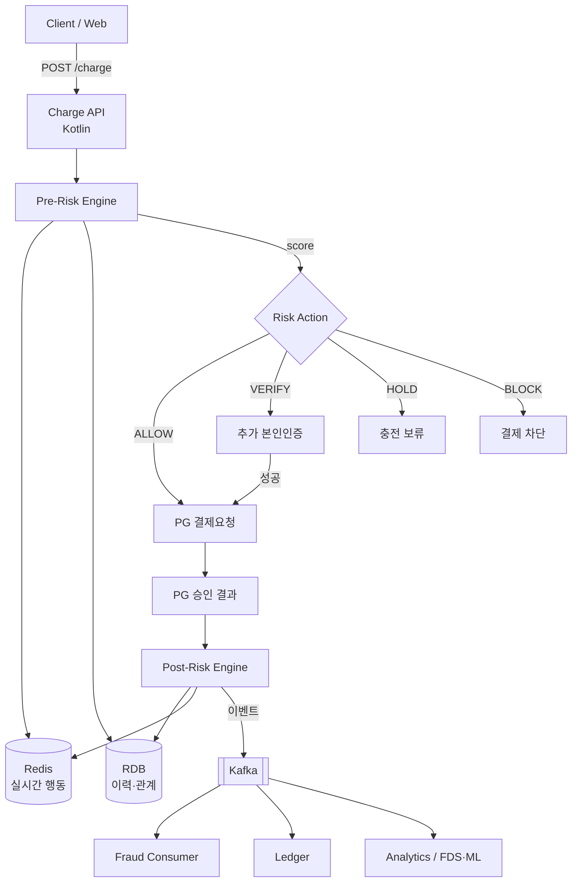
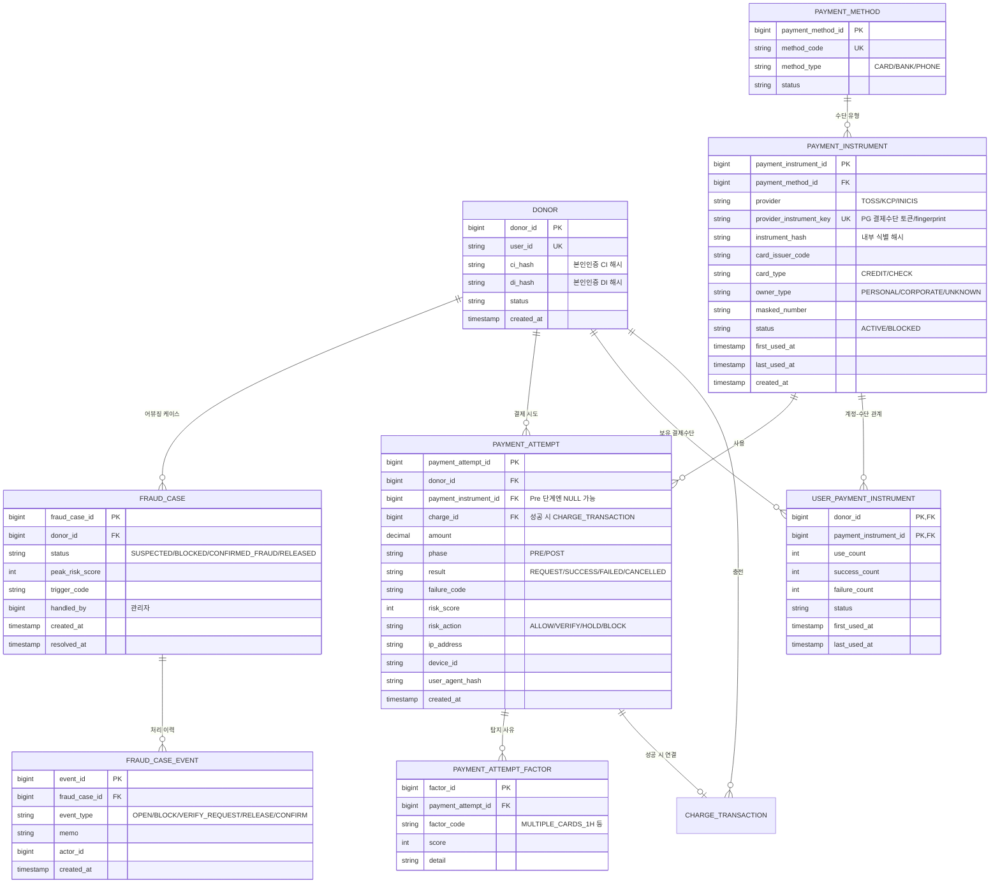
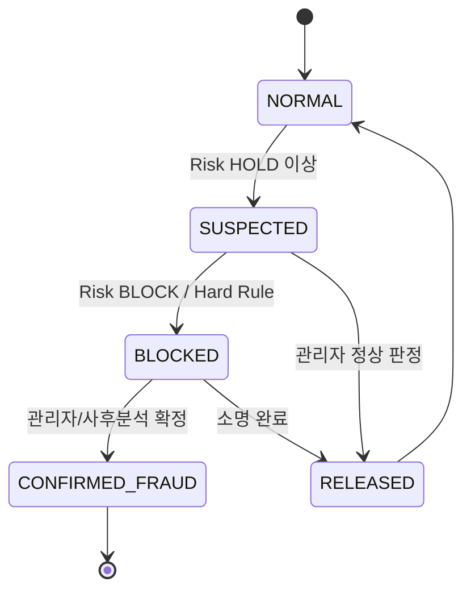
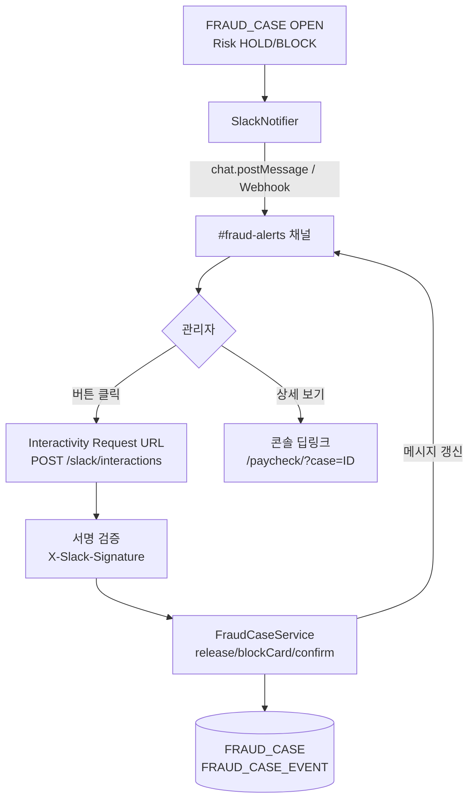

# 다중 카드 충전 어뷰징 탐지 시스템 — 설계 명세

타인 명의/도난 카드로 캐시를 충전한 뒤 후원하는 결제 어뷰징을 탐지·제어하기 위한 설계 문서입니다.
후원 원장([LEDGER_ERD.md](LEDGER_ERD.md))의 `DONOR` · `CHARGE_TRANSACTION` · `PAYMENT_METHOD`와 연결되는 것을 전제로 합니다.

> **설계 원칙**
> 1. 카드번호 원본을 저장하지 않는다. PG가 제공하는 결제수단 식별값(토큰/fingerprint)만 저장한다.
> 2. "명의 불일치"를 직접 판정하기보다 **결제수단 공유·행동 패턴** 기반 Risk Score로 제어한다.
> 3. **결제 전(Pre-Risk)** 과 **결제 후(Post-Risk)** 를 분리한다.
> 4. **"결제 차단(Block)"** 과 **"부정결제 확정(Confirmed Fraud)"** 은 별개 상태로 관리한다.

---

## 1. 전체 아키텍처



**핵심**: Pre-Risk는 결제 전에 알 수 있는 정보(계정·금액·IP·Device·최근 행동)로 판단하고,
Post-Risk는 PG 승인 후 확보되는 카드 식별값으로 재평가한다.

---

## 2. DB ERD



### 테이블 역할 요약

| 테이블 | 역할 | 어뷰징 탐지에서의 의미 |
|---|---|---|
| `PAYMENT_INSTRUMENT` | 결제수단(카드) 마스터 | 카드번호 없이 PG 토큰으로 동일 카드 식별 |
| `USER_PAYMENT_INSTRUMENT` | 계정 ↔ 결제수단 N:M | **한 카드가 여러 계정에서 쓰이는지** 역추적 |
| `PAYMENT_ATTEMPT` | 모든 결제 시도 원장 | 시도/실패/성공, Risk Score 이력 |
| `PAYMENT_ATTEMPT_FACTOR` | 시도별 탐지 사유 | 관리자 화면 "차단 사유" 근거 |
| `FRAUD_CASE` | 어뷰징 케이스(상태머신) | 결제 차단과 부정결제 확정을 분리 관리 |

> 가장 중요한 두 테이블은 `PAYMENT_INSTRUMENT`와 `USER_PAYMENT_INSTRUMENT`.
> `USER→CARD`(정상일 수 있음)와 `CARD→USER`(강한 어뷰징 신호)를 모두 조회할 수 있어야 한다.

---

## 3. Redis Key 설계

DB는 영속 이력, Redis는 최근 행동을 빠르게 판단하기 위한 슬라이딩 윈도우로 사용한다.
모든 윈도우 Key는 **Sorted Set (score = epoch초, member = 식별값)** 으로 관리한다.

| Key | 타입 | 의미 |
|---|---|---|
| `fraud:user:{donorId}:cards:1h` | ZSet | 최근 1시간 사용 카드 식별값 |
| `fraud:user:{donorId}:cards:24h` | ZSet | 최근 24시간 사용 카드 |
| `fraud:user:{donorId}:attempts:10m` | ZSet | 최근 10분 시도 |
| `fraud:user:{donorId}:attempts:1h` | ZSet | 최근 1시간 시도 |
| `fraud:user:{donorId}:failures:1h` | ZSet | 최근 1시간 실패 |
| `fraud:user:{donorId}:amount:1h` | String(INCR) | 최근 1시간 누적 충전액 |
| `fraud:user:{donorId}:ip:1h` | ZSet | 최근 1시간 사용 IP |
| `fraud:user:{donorId}:device:1h` | ZSet | 최근 1시간 사용 Device |
| `fraud:card:{cardKey}:users:24h` | ZSet | **역방향**: 카드가 쓰인 계정들 |
| `fraud:ip:{ip}:users:1h` | ZSet | IP가 쓰인 계정들 |
| `fraud:device:{deviceId}:users:24h` | ZSet | Device가 쓰인 계정들 |

### 슬라이딩 윈도우 갱신 패턴 (개별 member TTL 불가 → 트림 방식)

```
ZADD  fraud:user:{id}:cards:1h  {now}  {cardKey}
ZREMRANGEBYSCORE  fraud:user:{id}:cards:1h  -inf  ({now}-3600)
EXPIRE  fraud:user:{id}:cards:1h  7200
```

> **원자성**: 한 결제에서 카드 추가·시도 증가·금액 증가·실패 카운트·TTL 갱신을 함께 처리해야 하므로,
> 위 작업을 **Lua Script 하나**로 묶어 race condition을 방지한다.

### 특징 계산 (Redis 조회 결과 → Feature)

```
distinctCards1h  = ZCARD fraud:user:{id}:cards:1h
attempts1h       = ZCARD fraud:user:{id}:attempts:1h
failures1h       = ZCARD fraud:user:{id}:failures:1h
failureRate1h    = failures1h / max(attempts1h, 1)
usersByCard24h   = ZCARD fraud:card:{cardKey}:users:24h
usersByDevice24h = ZCARD fraud:device:{deviceId}:users:24h
```

---

## 4. 탐지 Rule (Risk Factor)

단일 조건으로 차단하지 않고, 각 조건에 점수를 부여해 합산한다.

| 코드 | 조건 | 점수 | 비고 |
|---|---|---:|---|
| `MULTIPLE_CARDS_1H` | 1시간 내 서로 다른 카드 3장 | +15 | |
| `EXCESSIVE_CARDS_1H` | 1시간 내 5장 이상 | +35 | 누적(합 +50) |
| `MULTIPLE_FAILURES` | 1시간 내 결제 실패 3회 이상 | +20 | |
| `HIGH_FAILURE_RATE` | 실패율 70% 이상 | +20 | |
| `FAIL_THEN_SWITCH` | 다른 카드 연속 실패 후 성공 | +30 | **강한 신호** |
| `CARD_MULTI_ACCOUNT` | 동일 카드 24h 내 3계정 이상 | +40 | **매우 강한 신호** |
| `DEVICE_MULTI_ACCOUNT` | 동일 Device 3계정 이상 | +30 | |
| `IP_MULTI_ACCOUNT` | 동일 IP 5계정 이상 | +20 | NAT 오탐 주의(약하게) |
| `NEW_CARD` | 신규 결제수단 | +10 | |
| `HIGH_AMOUNT` | 고액 충전(정책값) | +10~50 | 한도 기준 조정 |
| `NEW_ACCOUNT` | 신규 가입 계정 | +10 | |

### 조합 Rule (개별 합산보다 우선 가산)

| 코드 | 조합 | 추가 점수 |
|---|---|---:|
| `COMBO_NEW_MULTI_HIGH` | 신규계정 + 다중카드 + 고액 + 즉시후원 | +70 |
| `COMBO_FAIL_SWITCH_DONATE` | 반복 실패 → 카드 교체 성공 → 대량 후원 | +50 |

### 즉시 차단(Hard Rule) — 점수와 무관하게 BLOCK

- 동일 카드가 단기간 **5개 이상 계정**에서 사용
- 10분 내 **카드 5장 이상 + 실패 3회 이상**
- `status=BLOCKED` 결제수단 재사용 시도
- 동일 Device + 다수 계정 + 다수 카드 + 고액 충전

---

## 5. Risk Score → Action / 상태 정책

### Action 임계값 (초기 정책값)

| Score | Action | 결제 처리 | 의미 |
|---|---|---|---|
| 0 ~ 29 | `ALLOW` | ✅ 허용 | 일반 사용자 |
| 30 ~ 49 | `VERIFY` | 추가 본인인증 후 진행 | 경미한 이상 |
| 50 ~ 69 | `HOLD` | ⚠️ 충전 보류 / 소프트 차단 | 어뷰징 가능성 높음 |
| 70 이상 | `BLOCK` | 🚫 PG 요청 자체를 차단 | 부정결제 가능성 매우 높음 |

> **"몇 점 이상 Block?" 결론**: 초기값 **70점 이상 = 결제 차단(Block)**.
> 단 70점을 "부정결제 확정"으로 보지 말 것 — Block은 결제를 막는 행위이고,
> 확정은 아래 `FRAUD_CASE` 상태로 별도 관리한다. (75점이라도 고객센터 확인 결과 정상일 수 있음)
>
> 금액 가중을 함께 볼 것: `Risk 40 + 1만원 → VERIFY`, `Risk 40 + 100만원 → HOLD`.

### 서비스 초기(데이터 부족기) 보수적 시작값

```
0~39   ALLOW
40~59  VERIFY
60~79  HOLD
80+    BLOCK
```

1~3개월 실제 데이터(정상 비율·취소율·환불율·차지백율·확정율) 수집 후
Score 구간별 성능을 분석해 60/70/80 임계값을 튜닝한다.

### 결제 차단(Action) vs 부정결제 확정(FraudStatus) 분리



---

## 6. Kotlin API Flow

```
POST /api/v1/charge
  → 인증
  → ChargeRequest 검증
  → PaymentInstrument 조회/생성
  → PaymentRiskService.evaluate(Pre)
  → Action 분기: ALLOW→PG / VERIFY→인증 / HOLD·BLOCK→중단
  → PG 승인
  → Post-Risk 재평가 + Redis/DB 갱신 + Kafka 발행
```

### 도메인 모델

```kotlin
data class PaymentRiskContext(
    val donorId: Long,
    val instrumentKey: String?,   // Pre 단계엔 null 가능
    val amount: Long,
    val ip: String,
    val deviceId: String,
    val phase: RiskPhase          // PRE / POST
)

enum class RiskAction { ALLOW, VERIFY, HOLD, BLOCK }
enum class RiskPhase  { PRE, POST }

data class RiskFactor(val code: String, val score: Int, val detail: String? = null)

data class PaymentRiskResult(
    val score: Int,
    val action: RiskAction,
    val factors: List<RiskFactor>
)

data class PaymentRiskFeatures(
    val distinctCards1h: Int,
    val distinctCards24h: Int,
    val attempts1h: Int,
    val failures1h: Int,
    val failureRate1h: Double,
    val amount1h: Long,
    val usersByCard24h: Int,
    val usersByDevice24h: Int,
    val usersByIp1h: Int,
    val isNewCard: Boolean,
    val isNewAccount: Boolean
)
```

### Rule Engine

```kotlin
@Component
class PaymentRiskRuleEngine(
    private val props: FraudProperties   // 임계값/점수 외부 설정화
) {
    fun evaluate(ctx: PaymentRiskContext, f: PaymentRiskFeatures): PaymentRiskResult {
        val factors = mutableListOf<RiskFactor>()

        // 즉시 차단(Hard Rule)
        if (f.usersByCard24h >= 5) {
            return PaymentRiskResult(100, RiskAction.BLOCK,
                listOf(RiskFactor("HARD_CARD_5_ACCOUNTS", 100)))
        }

        if (f.distinctCards1h >= 3) factors += RiskFactor("MULTIPLE_CARDS_1H", 15)
        if (f.distinctCards1h >= 5) factors += RiskFactor("EXCESSIVE_CARDS_1H", 35)
        if (f.failures1h >= 3)      factors += RiskFactor("MULTIPLE_FAILURES", 20)
        if (f.failureRate1h >= 0.7) factors += RiskFactor("HIGH_FAILURE_RATE", 20)
        if (f.usersByCard24h >= 3)  factors += RiskFactor("CARD_MULTI_ACCOUNT", 40)
        if (f.usersByDevice24h >= 3)factors += RiskFactor("DEVICE_MULTI_ACCOUNT", 30)
        if (f.isNewCard)            factors += RiskFactor("NEW_CARD", 10)
        if (f.isNewAccount)         factors += RiskFactor("NEW_ACCOUNT", 10)
        factors += amountFactor(ctx.amount)

        val score = factors.sumOf { it.score }
        val action = decideAction(score, ctx.amount)
        return PaymentRiskResult(score, action, factors)
    }

    private fun amountFactor(amount: Long): RiskFactor = when {
        amount >= 1_000_000 -> RiskFactor("HIGH_AMOUNT", 50)
        amount >=   500_000 -> RiskFactor("HIGH_AMOUNT", 30)
        amount >=   300_000 -> RiskFactor("HIGH_AMOUNT", 20)
        amount >=   100_000 -> RiskFactor("HIGH_AMOUNT", 10)
        else -> RiskFactor("AMOUNT_OK", 0)
    }

    // 금액 가중 임계값
    private fun decideAction(score: Int, amount: Long): RiskAction {
        val highAmount = amount >= 500_000
        return when {
            score >= 70 -> RiskAction.BLOCK
            score >= 50 -> RiskAction.HOLD
            score >= 30 -> if (highAmount) RiskAction.HOLD else RiskAction.VERIFY
            else        -> RiskAction.ALLOW
        }
    }
}
```

### Risk Service

```kotlin
@Service
class PaymentRiskService(
    private val redis: FraudRedisRepository,
    private val engine: PaymentRiskRuleEngine
) {
    fun evaluate(ctx: PaymentRiskContext): PaymentRiskResult =
        engine.evaluate(ctx, redis.loadFeatures(ctx))
}
```

### 충전 API

```kotlin
@Transactional
fun charge(donorId: Long, req: ChargeRequest, ip: String, deviceId: String): ChargeResponse {
    val instrument = paymentInstrumentService.resolve(donorId, req.paymentToken)

    val ctx = PaymentRiskContext(
        donorId = donorId,
        instrumentKey = instrument?.key,
        amount = req.amount,
        ip = ip, deviceId = deviceId,
        phase = RiskPhase.PRE
    )
    val risk = paymentRiskService.evaluate(ctx)

    val attempt = paymentAttemptRepository.save(
        PaymentAttempt.pre(donorId, instrument?.id, req.amount, risk, ip, deviceId)
    )
    riskFactorRepository.saveAll(attempt.id, risk.factors)

    return when (risk.action) {
        RiskAction.BLOCK  -> { fraudCaseService.open(donorId, risk); throw PaymentFraudBlockedException(risk) }
        RiskAction.HOLD   -> { fraudCaseService.open(donorId, risk); ChargeResponse.hold("결제 확인이 필요합니다.") }
        RiskAction.VERIFY -> verificationService.start(donorId, attempt.id)
        RiskAction.ALLOW  -> pgService.requestPayment(donorId, instrument, req)   // → 승인 후 Post-Risk
    }
}
```

### Post-Risk (PG 승인 콜백)

```kotlin
fun onPgApproved(attemptId: Long, pg: PgPaymentResult) {
    val instrument = paymentInstrumentService.upsertFromPg(pg)  // 카드 식별값 확정
    userPaymentInstrumentService.link(pg.donorId, instrument.id) // 계정-카드 관계

    redis.recordSuccess(pg.donorId, instrument.key, pg.amount, pg.ip, pg.deviceId) // Lua 원자갱신

    val post = paymentRiskService.evaluate(
        PaymentRiskContext(pg.donorId, instrument.key, pg.amount, pg.ip, pg.deviceId, RiskPhase.POST)
    )
    paymentAttemptRepository.markSuccess(attemptId, post)

    // 이미 승인된 결제를 임의 취소하기보다, 의심 시 충전금 지급 보류 + 추가검증
    if (post.action == RiskAction.HOLD || post.action == RiskAction.BLOCK) {
        chargeService.holdSettlement(attemptId)
        fraudCaseService.open(pg.donorId, post)
    }
    kafka.publish(PaymentEvent.success(pg, post))
}
```

---

## 7. Kafka Event Schema

결제→충전→후원→취소→정산을 하나의 Risk Graph로 확장하기 위한 이벤트.

```json
{
  "eventType": "PAYMENT_SUCCESS",
  "donorId": 10001,
  "paymentAttemptId": 55123,
  "chargeId": 123456,
  "paymentInstrumentId": 7788,
  "instrumentKey": "tok_xxx",
  "amount": 100000,
  "riskScore": 45,
  "riskAction": "ALLOW",
  "ip": "1.2.3.4",
  "deviceId": "dev_abc",
  "occurredAt": "2026-09-02T10:30:00+09:00"
}
```

| eventType | 발행 시점 | 소비자 |
|---|---|---|
| `PAYMENT_REQUEST` | 결제 요청 | Fraud Consumer |
| `PAYMENT_SUCCESS` / `PAYMENT_FAILED` | PG 결과 | Fraud / Ledger / Analytics |
| `PAYMENT_CANCELLED` / `CHARGEBACK` | 취소·차지백 | Fraud(사후 확정) / Ledger |
| `DONATION_COMPLETED` | 후원 완료 | Analytics(충전 직후 후원 패턴) |

---

## 8. 관리자 화면 (요건)

케이스당 최소 다음을 노출한다.

```
┌────────────────────────────────────────────┐
│ DONOR 1000123      Risk 82   [BLOCKED]      │
├────────────────────────────────────────────┤
│ 최근 1시간                                  │
│  카드 5개 · 시도 8회(성공 2/실패 6)         │
│  충전 780,000원 · IP 2 · Device 1           │
├────────────────────────────────────────────┤
│ 결제수단 관계                               │
│  CARD_A ─ 3계정  ← 강한 신호                │
│  CARD_B/C/D/E ─ 1계정                        │
├────────────────────────────────────────────┤
│ 탐지 사유(factors)                          │
│  ● CARD_MULTI_ACCOUNT (+40)                 │
│  ● EXCESSIVE_CARDS_1H (+35)                 │
│  ● MULTIPLE_FAILURES  (+20)                 │
├────────────────────────────────────────────┤
│ [정상 해제] [부정결제 확정] [수단 차단]     │
└────────────────────────────────────────────┘
```

관리자 액션은 모두 `FRAUD_CASE_EVENT`에 기록(actor, memo, timestamp)한다.

---

## 9. Slack 알림 · 원클릭 처리

의심 케이스가 큐에 등록되는 순간(`FRAUD_CASE` OPEN) 담당 채널로 Slack 메시지를 보내고,
관리자가 **Slack 메시지의 버튼만으로 바로 처리**(정상 해제 / 결제수단 차단 / 부정결제 확정)할 수 있게 한다.
버튼 콜백은 **서명 검증되는 서버 엔드포인트**로 들어오므로, 정적 페이지가 아니라 백엔드(§6)가 처리한다.



### 9-1. 케이스 등록 시 발송하는 메시지 (Block Kit)

`actions` 블록의 각 버튼 `value`에 `caseId`와 처리 유형을 담고, "상세 보기"는 콘솔 딥링크로 연결한다.

```json
{
  "channel": "#fraud-alerts",
  "text": "🚨 어뷰징 의심 케이스 · DONOR 1000123 · Risk 160 (BLOCK)",
  "blocks": [
    { "type": "header", "text": { "type": "plain_text", "text": "🚨 어뷰징 의심 케이스 · BLOCK" } },
    { "type": "section", "fields": [
      { "type": "mrkdwn", "text": "*회원*\nDONOR 1000123 (밤샘고양이)" },
      { "type": "mrkdwn", "text": "*Risk Score*\n160 · BLOCK" },
      { "type": "mrkdwn", "text": "*최근 1h*\n카드 5장 · 시도 8(실패 6)" },
      { "type": "mrkdwn", "text": "*충전*\n780,000원 · IP 2 · 기기 1" }
    ]},
    { "type": "section", "text": { "type": "mrkdwn",
      "text": "*탐지 사유*\n• 동일 카드 다계정 (+40)\n• 카드 과다 사용 (+35)\n• 결제 반복 실패 (+20)" } },
    { "type": "actions", "block_id": "fraud_case:1000123", "elements": [
      { "type": "button", "style": "primary", "text": { "type": "plain_text", "text": "정상 해제" },
        "action_id": "case_release", "value": "1000123",
        "confirm": { "title": { "type": "plain_text", "text": "정상 해제" },
          "text": { "type": "plain_text", "text": "이 케이스를 정상으로 해제할까요?" },
          "confirm": { "type": "plain_text", "text": "해제" }, "deny": { "type": "plain_text", "text": "취소" } } },
      { "type": "button", "text": { "type": "plain_text", "text": "결제수단 차단" },
        "action_id": "case_block_card", "value": "1000123" },
      { "type": "button", "style": "danger", "text": { "type": "plain_text", "text": "부정결제 확정" },
        "action_id": "case_confirm_fraud", "value": "1000123",
        "confirm": { "title": { "type": "plain_text", "text": "부정결제 확정" },
          "text": { "type": "plain_text", "text": "되돌리기 어려운 처리입니다. 확정할까요?" },
          "confirm": { "type": "plain_text", "text": "확정" }, "deny": { "type": "plain_text", "text": "취소" } } },
      { "type": "button", "text": { "type": "plain_text", "text": "상세 보기" },
        "action_id": "case_open_console", "url": "https://mutzini94-dot.github.io/paycheck/?case=1000123" }
    ]}
  ]
}
```

### 9-2. 발송 (케이스 OPEN 훅)

```kotlin
@Component
class SlackNotifier(
    private val slack: SlackClient,            // Bolt SDK 또는 WebClient
    private val props: SlackProperties         // botToken, channel, consoleBaseUrl
) {
    fun notifyCaseOpened(c: FraudCase, f: PaymentRiskFeatures, risk: PaymentRiskResult) {
        slack.chatPostMessage(
            channel = props.channel,
            text = "🚨 어뷰징 의심 · DONOR ${c.donorId} · Risk ${risk.score} (${risk.action})",
            blocks = SlackBlocks.fraudCase(c, f, risk, props.consoleBaseUrl),
            metadata = mapOf("caseId" to c.id)  // 이후 메시지 갱신(ts) 매핑용
        ).also { res -> fraudCaseRepository.saveSlackRef(c.id, res.channel, res.ts) }
    }
}

// FraudCaseService.open() 끝에서 호출
fun open(donorId: Long, risk: PaymentRiskResult): FraudCase {
    val case = fraudCaseRepository.open(donorId, risk)          // SUSPECTED
    fraudEventRepository.add(case.id, "OPEN", actor = "SYSTEM")
    slackNotifier.notifyCaseOpened(case, risk.features, risk)   // ← Slack 발송
    return case
}
```

### 9-3. Slack 버튼 처리 엔드포인트

Slack 앱 설정의 **Interactivity Request URL**을 이 엔드포인트로 지정한다.
요청 서명(`X-Slack-Signature` + `X-Slack-Request-Timestamp`)을 **HMAC-SHA256**으로 검증하고,
`action_id`에 따라 케이스를 처리한 뒤 **원본 메시지를 처리 완료 상태로 갱신**한다(`response_url` 또는 `chat.update`).

```kotlin
@RestController
@RequestMapping("/slack")
class SlackInteractionController(
    private val verifier: SlackSignatureVerifier,   // signingSecret 기반
    private val fraudCaseService: FraudCaseService,
    private val slack: SlackClient
) {
    @PostMapping("/interactions", consumes = [MediaType.APPLICATION_FORM_URLENCODED_VALUE])
    fun onInteraction(
        @RequestHeader("X-Slack-Signature") sig: String,
        @RequestHeader("X-Slack-Request-Timestamp") ts: String,
        @RequestBody rawBody: String                 // 서명 검증은 원문(raw)으로
    ): ResponseEntity<Void> {
        // 1) 재전송(replay) 방지: 5분 초과 요청 거부 + 서명 검증
        require(verifier.isValid(sig, ts, rawBody)) { "invalid slack signature" }

        val payload = SlackPayload.parse(rawBody)     // form의 payload=... 파싱
        val action  = payload.actions.first()
        val caseId  = action.value.toLong()
        val admin   = payload.user.username

        val result = when (action.actionId) {
            "case_release"       -> fraudCaseService.release(caseId, admin)        // RELEASED
            "case_block_card"    -> fraudCaseService.blockInstrument(caseId, admin) // 수단 BLOCKED
            "case_confirm_fraud" -> fraudCaseService.confirmFraud(caseId, admin)    // CONFIRMED_FRAUD
            else -> return ResponseEntity.ok().build()
        }

        // 2) 처리 결과로 원본 메시지 갱신(버튼 제거 + 처리자/시각 표기)
        slack.chatUpdate(
            channel = payload.channel.id, ts = payload.message.ts,
            blocks = SlackBlocks.fraudCaseResolved(result, admin)
        )
        return ResponseEntity.ok().build()            // 3s 이내 200 응답
    }
}
```

```kotlin
@Component
class SlackSignatureVerifier(private val props: SlackProperties) {
    fun isValid(signature: String, timestamp: String, body: String): Boolean {
        if (abs(nowEpoch() - timestamp.toLong()) > 60 * 5) return false   // replay 차단
        val base = "v0:$timestamp:$body"
        val mac = Mac.getInstance("HmacSHA256").apply {
            init(SecretKeySpec(props.signingSecret.toByteArray(), "HmacSHA256"))
        }
        val computed = "v0=" + mac.doFinal(base.toByteArray()).toHex()
        return MessageDigest.isEqual(computed.toByteArray(), signature.toByteArray()) // 상수시간 비교
    }
}
```

### 9-4. "Slack URL에서 직접 처리"의 두 경로

| 방식 | 동작 | 처리 위치 |
|---|---|---|
| **버튼(권장)** | 메시지의 정상 해제/차단/확정 버튼 클릭 → `/slack/interactions` | Slack ↔ 백엔드 (콘솔 안 열어도 됨) |
| **상세 보기 딥링크** | `…/paycheck/?case=ID` 로 콘솔 오픈 → 해당 케이스 자동 선택 | 콘솔에서 처리 |

### 9-5. 보안 · 운영 주의

- **서명 검증 필수** — `signingSecret`으로 HMAC 검증하지 않으면 누구나 케이스를 처리할 수 있다.
- **타임스탬프 5분 제한**으로 재전송 공격 차단, 비교는 **상수시간**(`MessageDigest.isEqual`).
- `botToken` / `signingSecret`은 코드가 아닌 **시크릿 저장소**(env·Vault)에서 주입.
- 확정처럼 되돌리기 어려운 처리는 Block Kit `confirm` 다이얼로그로 **2단계 확인**.
- 처리 후 **버튼을 제거**해 중복 처리를 막고, 누가/언제 처리했는지 메시지에 남긴다(`FRAUD_CASE_EVENT`와 동일).
- 알림 폭주 방지: 동일 회원 재알림은 **스레드로 묶거나** 일정 시간 **쿨다운**.

---

## 10. 운영 · 튜닝 체크리스트

- [ ] 점수·임계값은 코드 하드코딩이 아닌 **외부 설정(`FraudProperties`)** 으로 관리 → 무중단 튜닝
- [ ] Redis 갱신은 **Lua Script 원자 처리**
- [ ] IP 룰은 NAT(PC방·회사·학교) 오탐 고려해 약하게
- [ ] 가족카드/법인카드 등 `CARD_MULTI_ACCOUNT` 정상 사례 화이트리스트 경로 확보
- [ ] 승인 완료 결제는 임의 취소보다 **충전금 지급 보류 + 소명** 우선
- [ ] 월 1회 Score 구간별 정상/취소/환불/차지백/확정 비율 리뷰 후 임계값 조정
- [ ] Pre-Risk는 저지연(수 ms) 유지 — 무거운 그래프 탐색은 Post/배치로

---

## 11. 향후 확장

- `USER ↔ CARD ↔ IP ↔ DEVICE ↔ 본인인증`을 그래프로 묶어 군집(어뷰징 링) 탐지
- 누적 라벨(확정/정상) 축적 후 Rule 기반 → **ML 기반 FDS** 로 점진 전환
- 실제 연동 PG(토스페이먼츠/KG이니시스/NHN KCP 등)별 `provider_instrument_key` 제공 범위 확정 후 §2 매핑 확정
